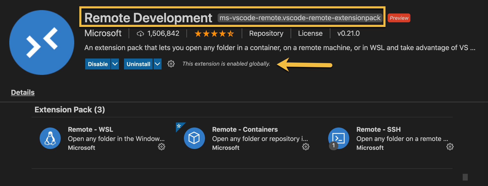

# :keyboard: ​ Setup: Visual Studio Code

The **What You Need** section indicated that you would need to have **Visual Studio Code** installed on your local machine for these exercises. Visual Studio Code supports enhanced features via _Extensions_ that can be installed from the Extensions Marketplace.

The Extensions Marketplace can be found by clicking the  on the left side of your Visual Studio Code window.

## Docker Extension

The first extension to add is the Docker extension. This will provide capabilities like syntax highlighting in Dockerfiles, autocompletion of instructions, and much more. You can read more about the Extension on the Visual Studio Code Market Place page.

1. _OPEN_ **Visual Studio Code**
2. _CLICK_ the **Extensions**  **Icon** on the left
3. _ENTER_ `ms-azuretools.vscode-docker` in the **Search Extensions in Marketplace** box
4. _SELECT_ **Install**

{target=\_blank}

## Remote Development Extension

The second Visual Studio Code Extension required is the Remove Development Extension Pack. This is a bundle of Extensions for connecting to different remote environments including SSH, Containers, and Windows.

This section will illustrate the additional Visual Studio Code Extension needed to integrate it with Docker.

3. _CLICK_ in the **Search Extensions in Marketplace** box
4. _ENTER_ `ms-vscode-remote.vscode-remote-extensionpack` in the **Search Extensions in Marketplace ** box
5. _SELECT_ **Install**

!!! note
Reload the window if prompted.

The Extension details will indicate that the extension is installed and enabled as seen below.

{target=\_blank}

## What's Next

Now that you have installed the required **Visual Studio Code Extensions** from the Marketplace you will create a new GitHub repository, clone that locally and open it in Visual Studio Code.
