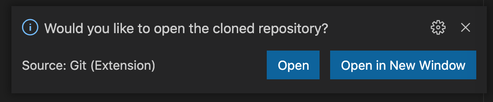

#  Create and Open a New Project

This section will guide you through creating a new repository on [GitHub](https://github.com) and opening that new repository in Visual Studio Code. 

## Create a Repo on GitHub

All of your development projects should start with creating a repository to store you hard work in a safe place.  

1. NAVIGATE to [GitHub](www.github.com)

2. *CLICK* the **New**  button next to **Repositories**

   

3. *NAME* the repo **docker-foundations-lab**

4. *SET* the repo to **Private** 

5. *CLICK* **Add a README file**
6. *CLICK* **Add .gitignore** and *SELECT* **Python**
7. *CLICK* **Choose a license** and *SELECT* **Apache License 2.0**
8. *CLICK* **Create Repository**

{target=_blank}

Now that you have created your new repository on GitHub you can move forward with opening this new project in Visual Studio Code.

## Opening Your Repo in Visual Studio Code

There are two ways to approach this step:

1. Manually clone the repo from the terminal
2. Use the functionality built into Visual Studio Code

### Manually Clone Method

1. *OPEN* a new **Terminal**

2. *NAVIGATE* to your repo on GitHub

3. *CLICK* the **Code** button

4. *SELECT* the transport (HTTPS or SSH)

5. *CLICK* the **Copy** icon
   ​	{target=_blank}

6. *PASTE* `git clone` plus that string into your **Terminal**
  
    !!! example
        **SSH** `git clone git@github.com:jandiorio/docker-foundations-lab.git`
  
        **HTTPS** `git clone https://github.com/jandiorio/docker-foundations-lab.git`

    !!! important
        The command above will clone down the repository creating a subfolder with the name of the repo in the folder where you ran the command.

7. *OPEN* the new Folder in Visual Studio Code using **Open Folder**

### Clone and Open Directly in Visual Studio Code

1. *OPEN* a new **Visual Studio Code Window**

2. *CLICK* the **Explorer** icon 

3. *CLICK* **Clone Repository**

    

4. PASTE repository string

    

5. *SELECT* the **parent directory** 

    !!! tip
        I have a folder named development where all of my development projects are located.

6. *CLICK* **Open** in the dialog prompt to Open the Repository
    