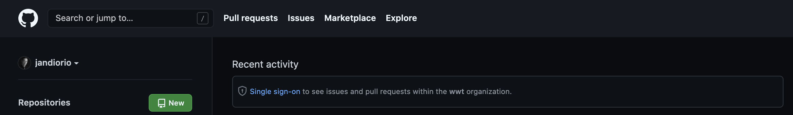
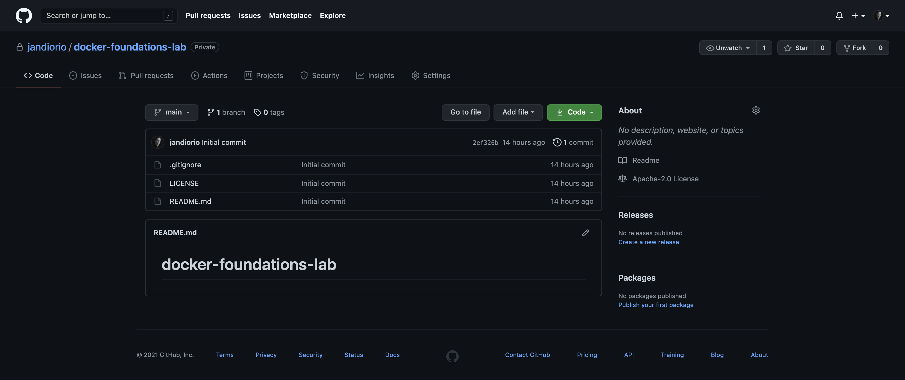
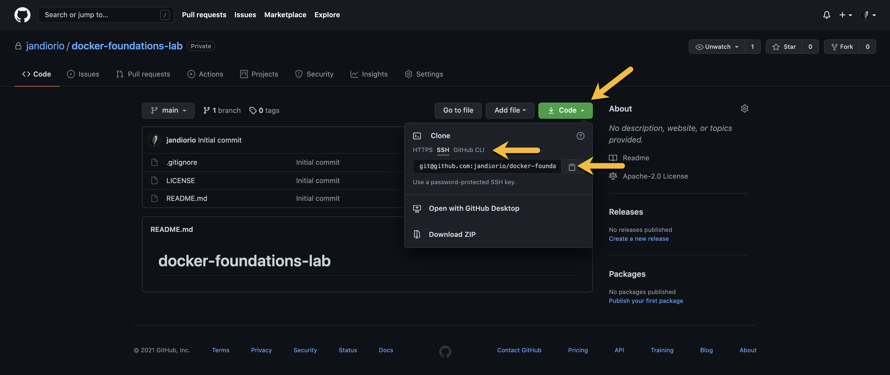
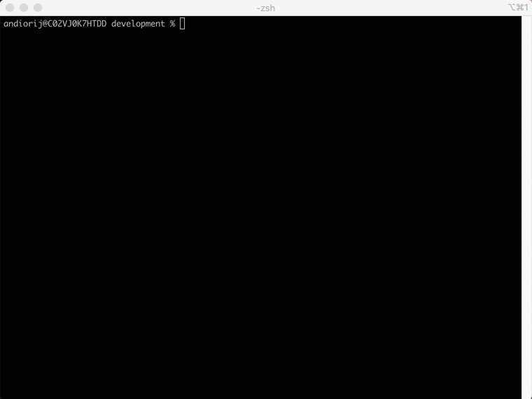
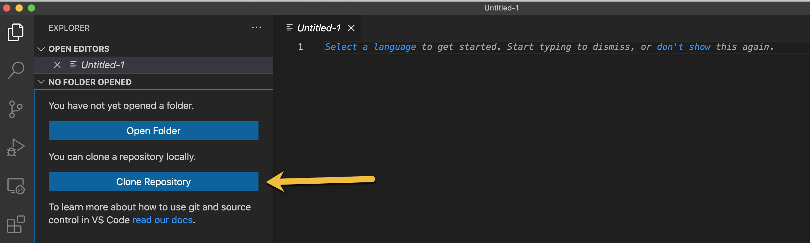
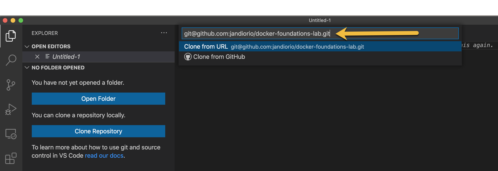

# Setup: Create and Open a New Project

This section will guide you through creating a new repository on [GitHub](https://github.com "GitHub"){target=_blank} and opening that new repository in Visual Studio Code.

!!! note
    There are multiple approaches to accomplish these same tasks.  This section represents one workflow.

## Create a Repo on GitHub

This workflow will start with creating a repository for your project on GitHub.  GitHub provides remote version control system for your local repository and many advanced collaboration capabilities.

You can learn more about GitHub in the [GitHub Documentation](https://docs.github.com/en/github "GitHub Documentation"){target=_blank}.

!!! note
    **Additional Resources**

    [Git Foundations Walk Through](https://wwt.github.io/git-foundations/ "Git Foundations Walk Through"){target=_blank}

    [Version Control Lab](https://www.wwt.com/lab/programmability-foundations-lab "Version Control Lab){target=_blank}

    [Version Control Video](https://www.wwt.com/video/introduction-to-version-control Version Control Video){target=_blank}

1. *NAVIGATE* to [**GitHub**](https://www.github.com "GitHub"){target=_blank}

2. *CLICK* the **New**  button next to **Repositories**

   {target=_blank}

   {target=_blank}

3. *NAME* the repo **docker-foundations-lab** (#1 in the image above)

4. *SET* the repo to **Private** (#2 in the image above)

5. *CLICK* **Add a README file** (# 3 in the image above)

6. *CLICK* **Add .gitignore** and *SELECT* **Python** (# 3 in the image above)

7. *CLICK* **Choose a license** and *SELECT* **Apache License 2.0** (# 3 in the image above)

8. *CLICK* **Create Repository** (# 4 in the image above)

{target=_blank}

Now that you have created your new repository on GitHub you can move forward with opening this new project in Visual Studio Code.

## Opening Your Repo in Visual Studio Code

There are two ways to approach this step:

1. Manually clone the repo from the terminal
2. Use the functionality built into Visual Studio Code

### Manually Clone Method

1. *NAVIGATE* to your repo on GitHub

2. *CLICK* the **Code** button

3. *SELECT* the transport (HTTPS or SSH)

4. *CLICK* the **Copy** icon
   ​	{target=_blank}

5. *OPEN* a new **Terminal**

6. *PASTE* `git clone` plus that string into your **Terminal**

    !!! example
        **SSH** `git clone git@github.com:jandiorio/docker-foundations-lab.git`

        **HTTPS** `git clone https://github.com/jandiorio/docker-foundations-lab.git`

    !!! important
        The command above will clone down the repository creating a subfolder with the name of the repo in the folder where you ran the command.

    {target=_blank}

7. *OPEN* the new Folder in Visual Studio Code using **Open Folder**

### Clone and Open Directly in Visual Studio Code

1. *OPEN* a new **Visual Studio Code Window**

2. *CLICK* the **Explorer** icon 

3. *CLICK* **Clone Repository**

    {target=_blank}

4. PASTE repository string

    {target=_blank}

5. *SELECT* the **parent directory**

    !!! tip
        I have a folder named development where all of my development projects are located.

6. *CLICK* **Open** in the dialog prompt to ***Open the Repository***
    

## What's Next

:tomato: Now you are ready to get to the "meat" of the tomato...next you will walk through the basics of building a `Dockerfile`.
